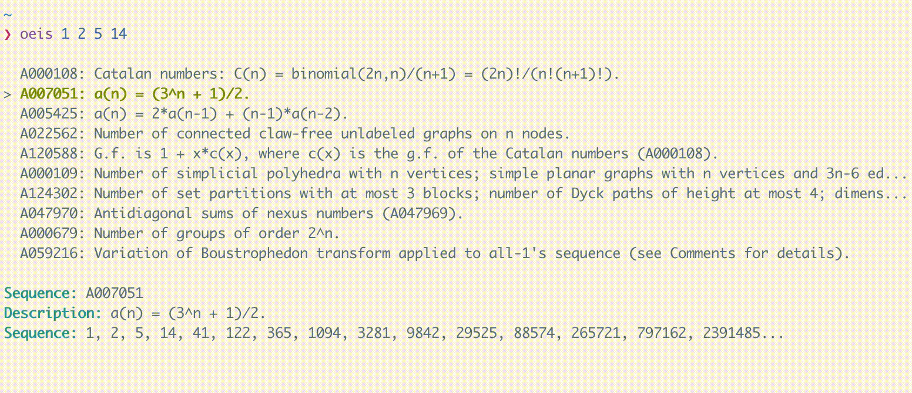

# OEIS

```text
❯ oeis --help
A command line interface to the OEIS.

Use the arrow keys to navigate the UI and the enter key to view the sequence on the OEIS. Press esc or q to exit.

Usage: oeis [OPTIONS] [SEQUENCE]...

Arguments:
  [SEQUENCE]...


Options:
  -l, --lucky
          Immediately go to the OEIS page for the first result

  -o, --online
          Search on the OEIS website

  -h, --help
          Print help (see a summary with '-h')
```

## Examples

You can use the CLI interactively:

<!--
ffmpeg -i demo.mov -ss 3 -t 4 -loop 0 -vf fps=5 demo.gif
-->



...or non-interactively:

```bash
# Search for sequences on the OEIS website
❯ oeis 2 3 5 7 --online

# Go directly to the OEIS page for my favorite sequence
❯ oeis 1 1 1 1 --lucky
```
